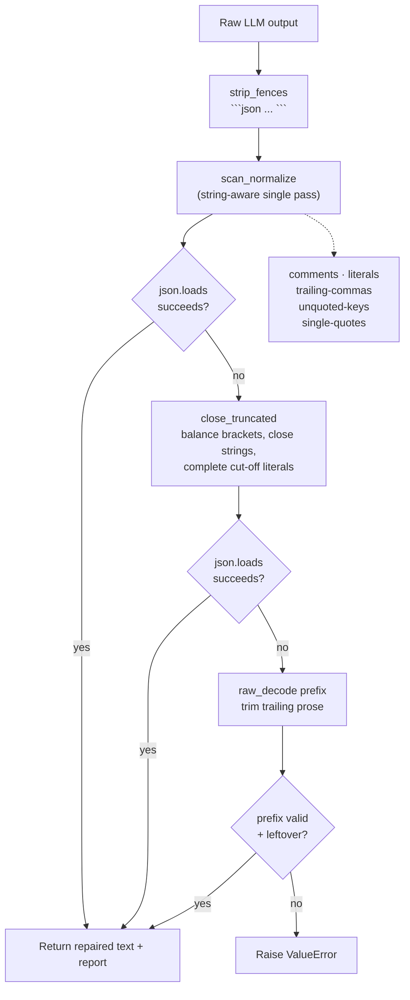

# llm-json-repair

**Repair malformed JSON from LLM outputs — zero dependencies, zero API keys.**

LLMs love to hand you *almost*-JSON: wrapped in Markdown fences, sprinkled with
`//` comments, trailing commas, unquoted keys, single quotes, `NaN`, cut off
mid-stream, or followed by "Hope this helps!". `llm-json-repair` turns all of
that into valid, parseable JSON — deterministically, with a report of every fix
applied.

```bash
echo "{name: 'demo', tags: ['a', 'b',],} // config" | python -m jsonrepair
```

```json
{
  "name": "demo",
  "tags": [
    "a",
    "b"
  ]
}
```

```
repaired: comments, trailing-commas, unquoted-keys, single-quotes
```

## What it fixes

| Fix | Example input | Repaired |
|-----|---------------|----------|
| `fences` | ```` ```json {"a": 1} ``` ```` | `{"a": 1}` |
| `comments` | `{"a": 1 // why` , `/* x */`, `# x` | `{"a": 1}` |
| `trailing-commas` | `{"a": 1,}` | `{"a": 1}` |
| `unquoted-keys` | `{name: "x"}` | `{"name": "x"}` |
| `single-quotes` | `{'a': 'it\'s'}` | `{"a": "it's"}` |
| `literals` | `NaN`, `Infinity`, `undefined` | `null` |
| `truncated-braces` | `{"a": {"b": [1` | `{"a": {"b": [1]}}` |
| `truncated-string` | `{"a": "hello` | `{"a": "hello"}` |
| `truncated-literal` | `{"ok": tru` | `{"ok": true}` |
| `trailing-garbage` | `{"a": 1}\nHope this helps!` | `{"a": 1}` |

All structural fixes are **string-aware**: URLs (`"https://x//y"`), code samples
and prose inside strings are never touched.

## Installation

No dependencies beyond the standard library (pytest for tests only).

```bash
git clone https://github.com/sulaimanvesal/llm-json-repair
cd llm-json-repair
pip install -r requirements.txt   # pytest, for running tests
```

## Usage

### CLI

```bash
# stdin -> stdout
cat broken.json | python -m jsonrepair

# file -> file, compact output
python -m jsonrepair broken.json -o fixed.json --compact

# just validate (exit 0 = valid or repairable, 1 = hopeless)
python -m jsonrepair --check broken.json && echo OK

# quiet mode (no repair report on stderr)
python -m jsonrepair -q broken.json
```

### Library

```python
from jsonrepair import loads_repair, repair_json

obj, report = loads_repair("{name: 'demo',}")  # ({"name": "demo"}, report)
print(report.applied)   # ['unquoted-keys', 'single-quotes', 'trailing-commas']
print(report.success)   # True

text, report = repair_json("```json\n[1, 2,\n```")
```

Raises `ValueError` when the input cannot be salvaged (e.g. plain prose).

## Architecture



The key design decision: one string-aware scan applies every safe structural
fix while copying string contents verbatim, so a URL like `"https://a//b"` is
never mistaken for a comment. Heavier fallbacks (truncation closing, prefix
extraction) only run if plain parsing still fails.

## Tests & demo

```bash
python -m pytest tests/ -q     # 31 tests
python demo/demo_repair.py     # 9 real-world broken outputs, repaired live
```

## License

MIT — see [LICENSE](LICENSE).
